# neuromeka-hri 패키지

**VIVE 컨트롤러**, **VIVE 얼티밋 트래커**, **스마트폰** 기반 기술교시를 진행하는 방법에 대한 안내입니다. 

---

## 1. 패키지 설치
### 1-1. 환경 요구사항
- **Python 버전:** 3.7 이상 3.11 이하
- **운영 체제:** Windows 환경에서 실행 권장
### 1-2. 패키지 설치
다음의 명령어를 터미널에 입력하면 패키지가 설치됩니다.
```bash
pip install neuromeka-hri
```

---

## 2. 디바이스 세팅

디바이스와 서버를 연결하려면 각 디바이스에 대한 초기 설정이 필요합니다.

### 2-1. 스마트폰
스마트폰을 이용한 기술교시를 진행하려면 다음과 같은 환경 및 설정이 필요합니다.
#### 요구 사항
- 안드로이드 기반 스마트폰
#### 기술교시 애플리케이션 설치 절차
1. 터미널(명령 프롬프트)에서 다음 명령어를 입력합니다:
    ```bash
    neuromeka-hri-install
    ```
2. 설치가 완료되면 다음 경로에서 어플리케이션 파일을 확인할 수 있습니다:
    ```
    C:\Users\neuromeka\neuromeka-hri\skill-teaching-phone.apk
    ```
#### 애플리케이션 실행 방법
1. `skill-teaching-phone.apk` 파일을 안드로이드 스마트폰에 전송하여 설치합니다.
2. 앱을 실행하면 다음과 같은 화면이 표시됩니다.
    >
        서버의 IP 주소를 입력한 후, 연결 버튼을 눌러 서버와의 연결을 준비합니다. 

### 2-2. VIVE 컨트롤러
VIVE 컨트롤러를 이용한 기술교시를 진행하려면 다음과 같은 시스템 환경 및 설정이 필요합니다.
#### 요구 사항
- VIVE 컨트롤러, HMD 헤드셋, 베이스 스테이션
#### SteamVR 설치, 실행
1. [SteamVR](https://store.steampowered.com/app/250820/SteamVR/)을 설치하세요. 
2. 설치가 완료되면 [VR 사용 준비 단계](https://help.steampowered.com/ko/faqs/view/7F7D-77FB-8CAA-4329)를 참고하여 베이스 스테이션과 HMD를 구성합니다.
3. SteamVR을 실행하여 VIVE 장치가 정상적으로 동작하는지 확인합니다.
    >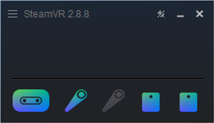
#### SteamVR 방 설정
- 정확한 위치 및 자세 추적을 위해 방 설정을 수행해야 합니다.
    >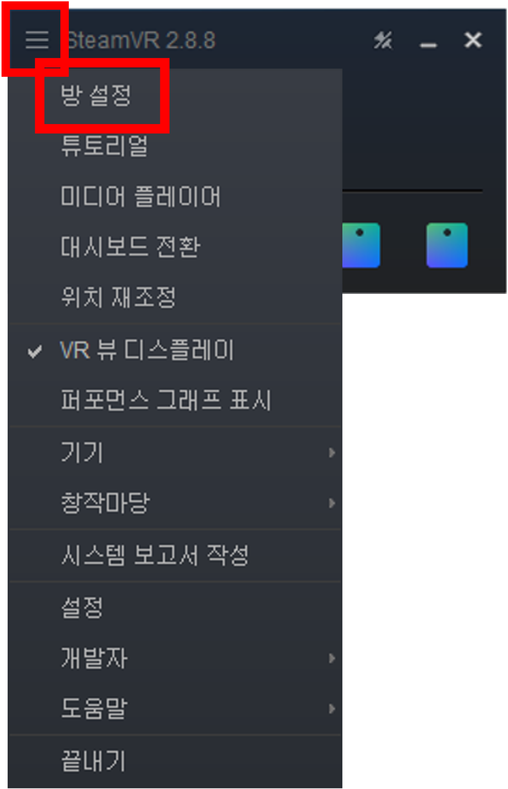
        SteamVR - 설정 - 방 설정에서 설정을 진행할 수 있습니다.
    >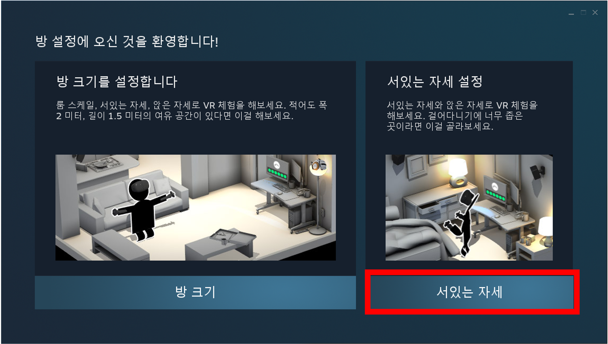
        "서 있는 자세" 모드를 선택합니다.
    >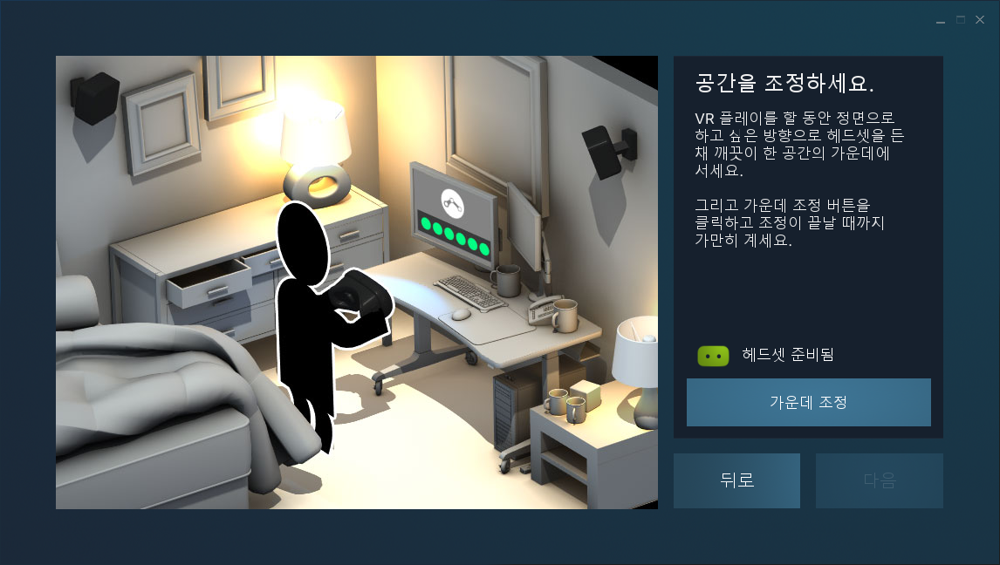
    >
        헤드셋을 고정한 후, 위치 및 바닥 조정을 진행하여 방 설정을 완료합니다.

###  2-3. VIVE 얼티밋 트래커
VIVE 얼티밋 트래커를 활용한 기술교시를 진행하려면 다음과 같은 시스템 환경 및 설정이 필요합니다.
#### 요구 사항
- 얼티밋 트래커, 무선 동글

#### VIVE 얼티밋 트래커 설정
1. [VIVE HUB](https://www.vive.com/kr/vive-hub/download/?_gl=1*19uvvr3*_up*MQ..*_ga*MTczNTcwMTA4NC4xNzM3Njk3MzQ1*_ga_68NRVQF2CG*MTczNzY5NzMyOS4xLjAuMTczNzY5NzMyOS4wLjAuMTcxNjA4Njg5NA..*_ga_42Q6WLJ9YV*MTczNzY5NzMyOS4xLjAuMTczNzY5NzMyOS4wLjAuMA..)를 설치하세요.
2. 무선 동글을 PC의 USB 포트에 연결합니다.
    >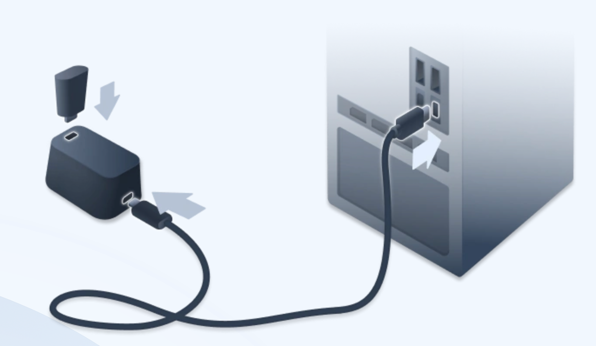
3. VIVE Hub를 실행한 후, 설정 - VIVE 얼티밋 트래커 메뉴에서 페어링 및 트래커 맵을 생성합니다.
    >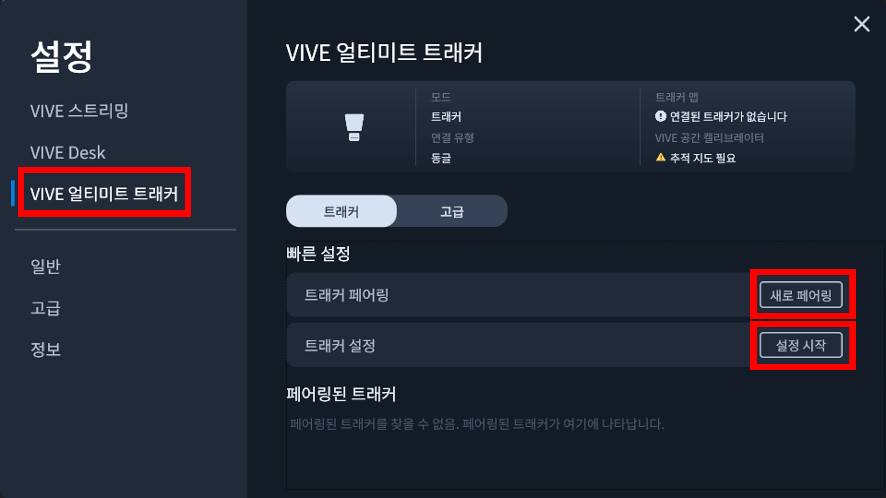
#### SteamVR 설치 및 드라이버 변경
1. [SteamVR](https://store.steampowered.com/app/250820/SteamVR/)을 설치하세요. 
2. 다음 두 개의 설정 파일을 수정하여 HMD 없이 트래커를 사용할 수 있도록 환경을 설정합니다.
    - **(1) SteamVR 기본 설정 파일**
        
        `C:\Program Files (x86)\Steam\steamapps\common\SteamVR\resources\settings\default.vrsettings`
    
        - **기존 설정 (변경 전):**
            ```json
            "steamvr": {
                "requireHmd": true,
                "forcedDriver": ""
            },
            ```
        - **변경 후 설정:**
            ```json
            "steamvr": {
                "requireHmd": false,
                "forcedDriver": "null"
            },
            ```
    - **(2) null driver 기본 설정 파일**
        
        `C:\Program Files (x86)\Steam\steamapps\common\SteamVR\drivers\null\resources\settings\default.vrsettings`
        
        - **기존 설정 (변경 전):**
            ```json
            "driver_null": {
                "enable": false},
            ```
        - **변경 후 설정:**
            ```json
            "driver_null": {
                "enable": true},
            ```
#### SteamVR 실행
SteamVR을 실행하여 VIVE 트래커가 정상적으로 작동하는지 확인합니다.
>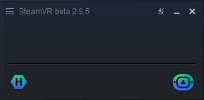
    
#### Web Console 실행
버튼을 사용하려면 Web Console을 실행해야 합니다.

1. SteamVR 실행 후 설정 메뉴로 이동:
    >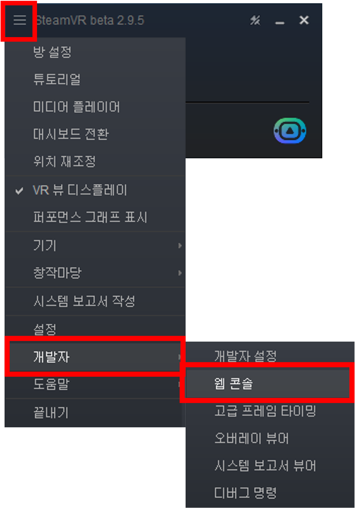
        SteamVR > 설정 > 개발자 > 웹 콘솔
2. 웹 콘솔 페이지 유지:
    >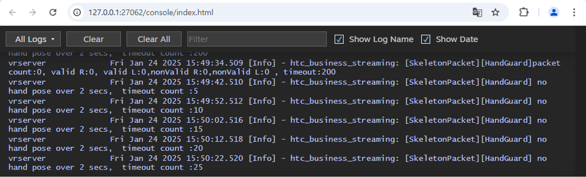
        아래 페이지를 계속 실행 상태로 유지해야 정상적으로 데이터를 받을 수 있습니다.

---

## 3. 서버 열기

1. 터미널에서 다음 명령어를 실행합니다:
    ```bash
    python -m neuromeka_hri.teleop_server
    ```  
2. 서버가 실행되며 **Server IP**가 출력됩니다.
3. 서버에서 디바이스와 데이터 저장 여부를 선택합니다.
    >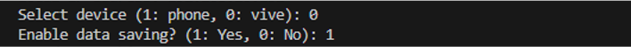

---

## 3. Conty 연결

1. **Conty를 로봇과 연결**합니다.
2. **설정** → **프로그램 환경** → **텔레오퍼레이션** 메뉴를 엽니다.
3. **교시장치**를 **Vive**로 선택합니다.
    >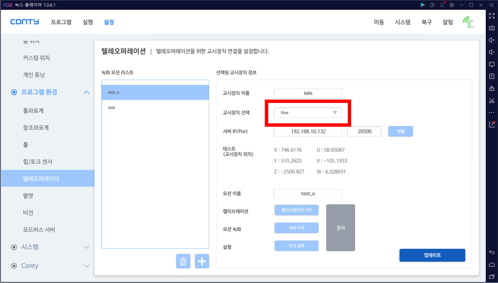
4. **Server IP**와 **Port 번호**(20500)를 입력한 후, 서버와 연결합니다.
    >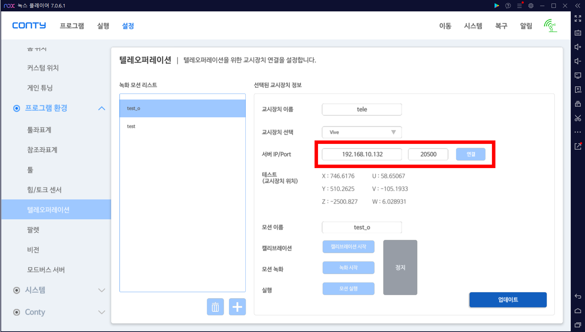
5. **테스트**: 교시장치의 위치 값을 확인하여 데이터가 변하는지 확인합니다.
    >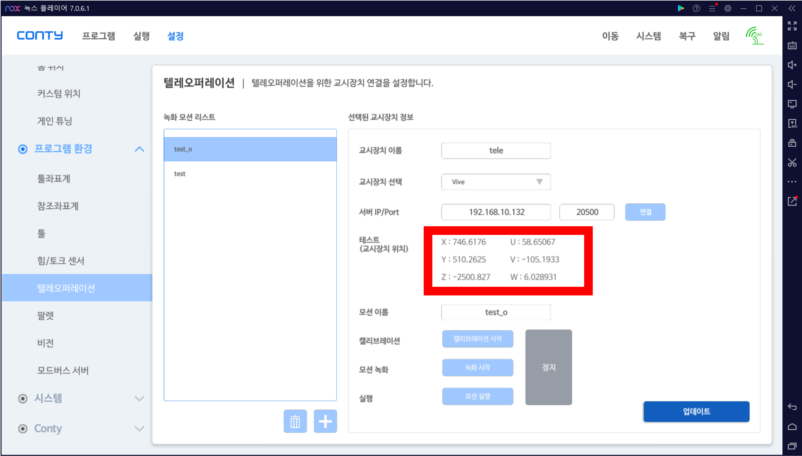

## 4. 기술 교시

>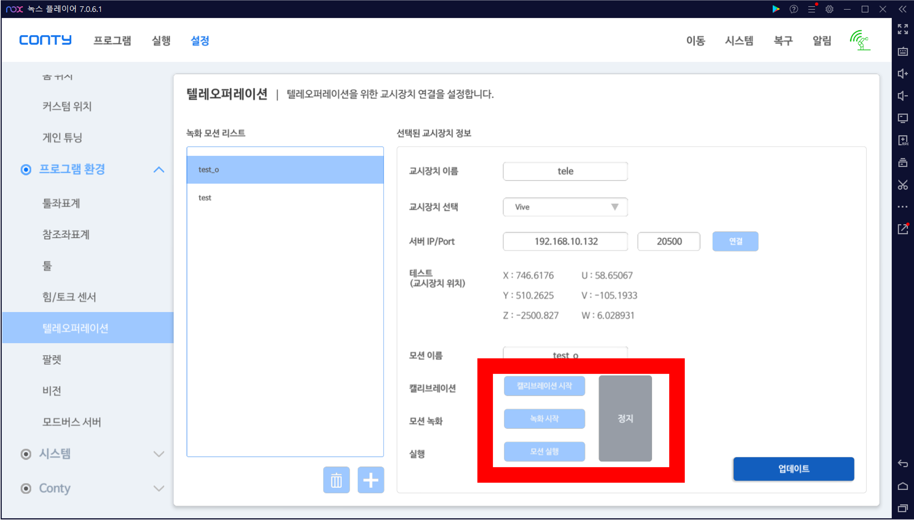

### 캘리브레이션 시작
* 디바이스를 로봇팔 말단에 위치시킨 후 **캘리브레이션 시작** 버튼을 클릭하면 캘리브레이션이 진행됩니다.
* 캘리브레이션이 끝나면, **업데이트 버튼**을 클릭해 저장합니다.

### 녹화 시작

* **녹화 시작** 버튼을 눌러 기술교시를 시작합니다.

* **스마트폰**

    * **Enable** 버튼이 **파란색**이면 모션 녹화 중, **회색** 버튼이 되면 일시 정지 상태입니다.
    * 카메라가 가려지면 연결이 끊어지거나 불안정한 위치 트래킹이 진행될 수 있습니다.

* **VIVE 컨트롤러**

    * **메뉴 버튼**을 누르고 있는 동안 모션 녹화가 진행되며, 버튼을 떼면 녹화가 일시 정지됩니다.
    * 베이스 스테이션 범위를 벗어나면 연결이 끊어지거나 불안정한 위치 트래킹이 진행될 수 있습니다.

* **VIVE 얼티밋 트래커**

    * 트래커 상단의 **Power 버튼**을 통해 모션 녹화와 일시정지가 토글 방식으로 진행됩니다.
    * 카메라가 가려지면 연결이 끊어지거나 불안정한 위치 트래킹이 진행될 수 있습니다.

### **모션 실행**
- **저장된 모션**을 로봇에서 실행할 수 있습니다.

---

## 5. 저장된 데이터 분석 및 시각화

### 서버 종료
>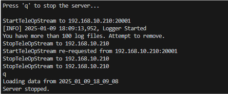
    터미널에서 'q'를 입력하여 서버를 종료합니다.

### 그래프 시각화
데이터 시각화를 통해 디바이스, 로봇의 경로와 위치 변화를 확인 할 수 있습니다.
- **파란색**: 로봇 위치 값
- **주황색**: 디바이스 입력 값
#### (1) 경로 그래프: x, y, z 위치의 3D 이동 경로
>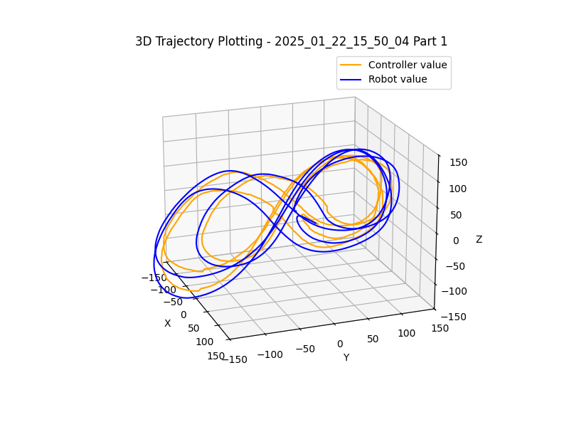
#### (2) 시간에 따른 위치 변화: x, y, z의 position 그래프
>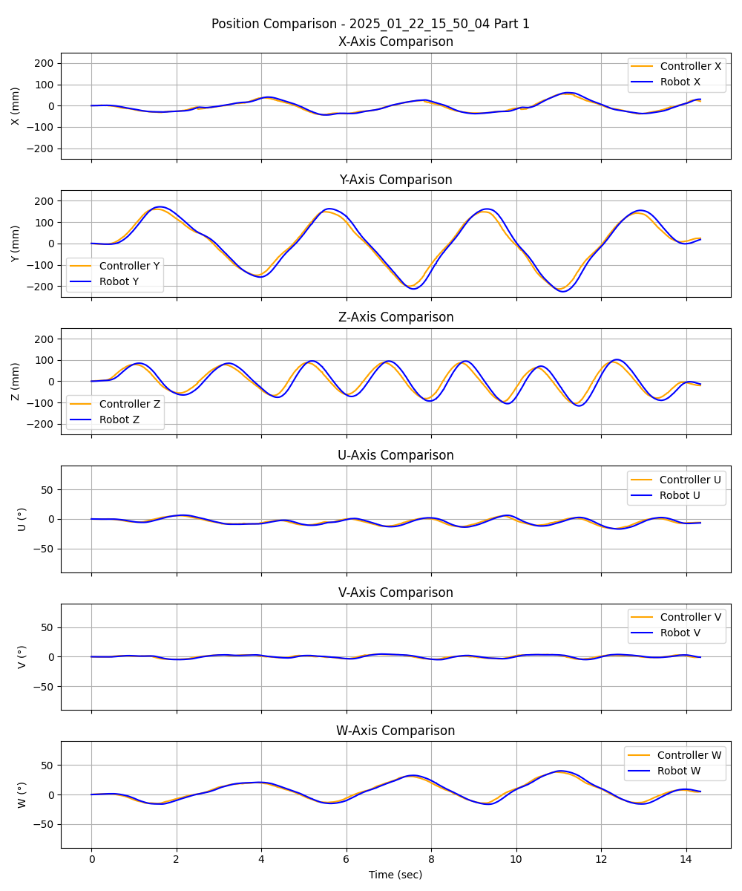

### **정량적 분석 결과**
>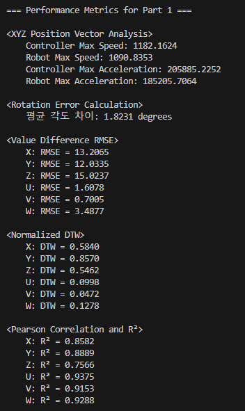
    컨트롤러와 로봇 간의 위치 및 움직임의 유사도를 정량적으로 평가할 수 있습니다. 

다음과 같은 정량적 분석 항목을 포함합니다:

* **속도 및 가속도 (Velocity & Acceleration)**
    - 최대 속도 비교 (Controller vs. Robot)
    - 최대 가속도 비교 (Controller vs. Robot)

* **각도 차이 (Angular Difference)**
    - 평균 각도 차이 비교

* **오차 분석 (Error Analysis - RMSE)**
    - x,y,z,u,v,w 축별 위치 오차 비교

* **궤적 분석 (Trajectory Analysis - DTW)**
    - x,y,z,u,v,w 축별 동적 시간 왜곡(DTW) 비교

* **상관 분석 (Correlation - R² 결정계수)**
    - x,y,z,u,v,w 축별 상관관계 비교
